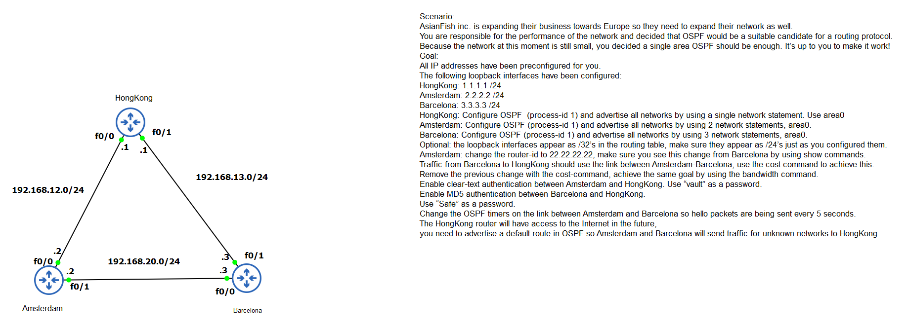
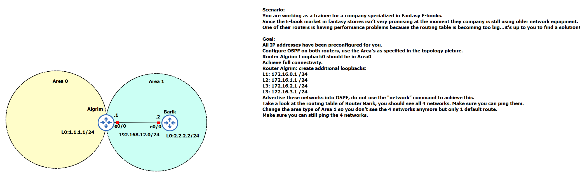
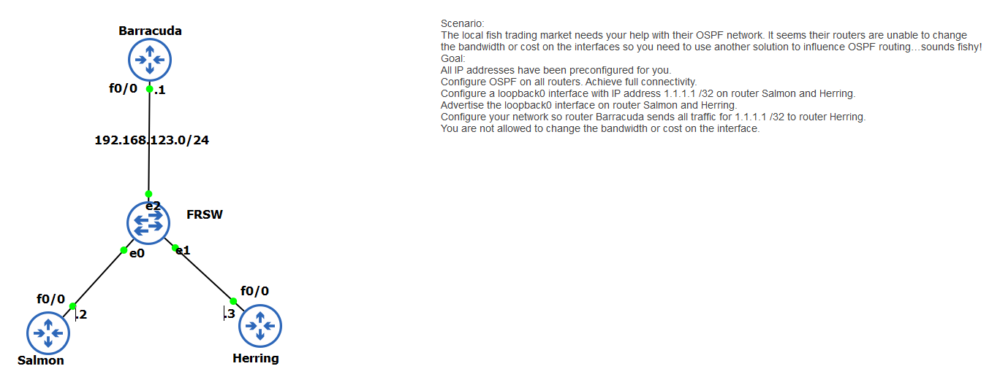
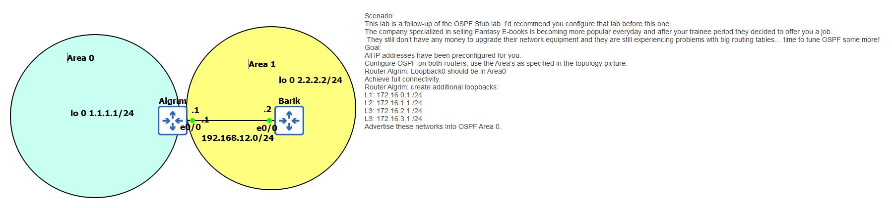
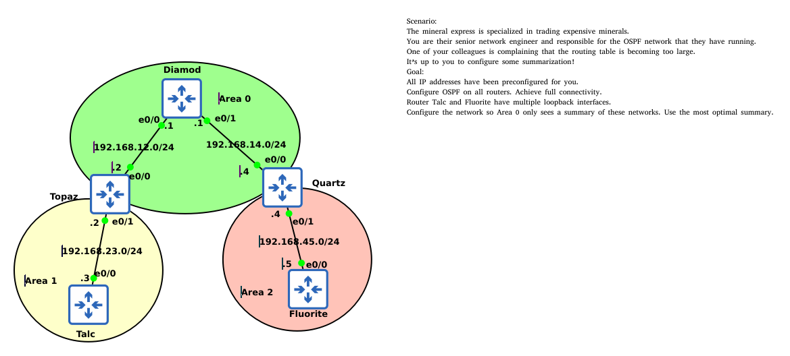
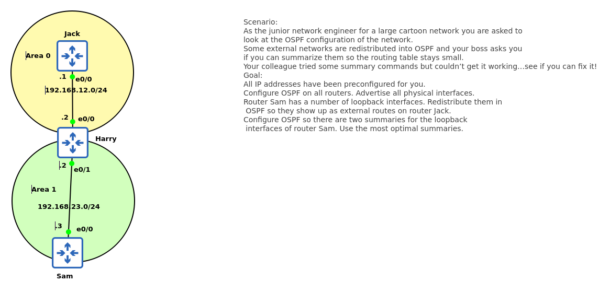
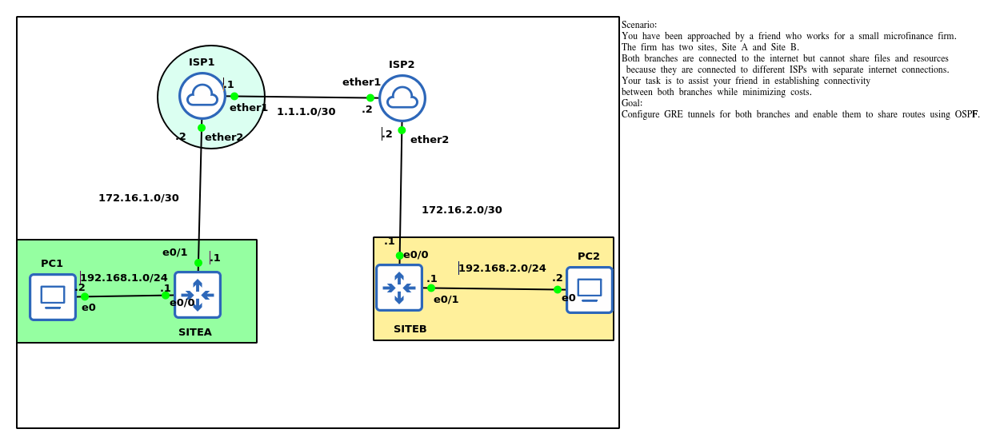

# NETWORKING LABS
This is a complete update of my networking labs.

## OSPF SINGLE AREA

# OSPF STUB AREA 

# OSPF PER NEIGHBOR COST

# OSPF TOTALLY STUB

# OSPF LSA TYPE 3 SUMMARIZATION

# OSPF LSA TYPE 5 SUMMARIZATION

# GRE WITH OSPF
